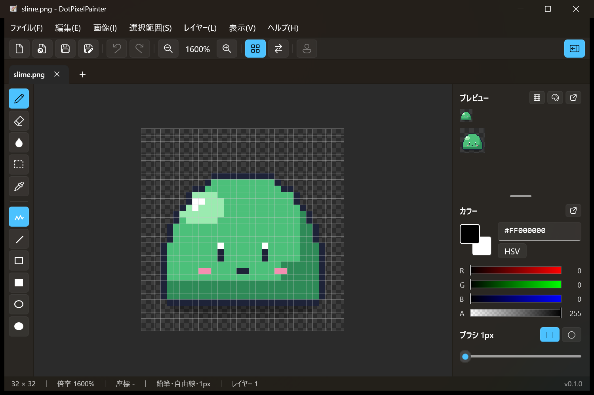
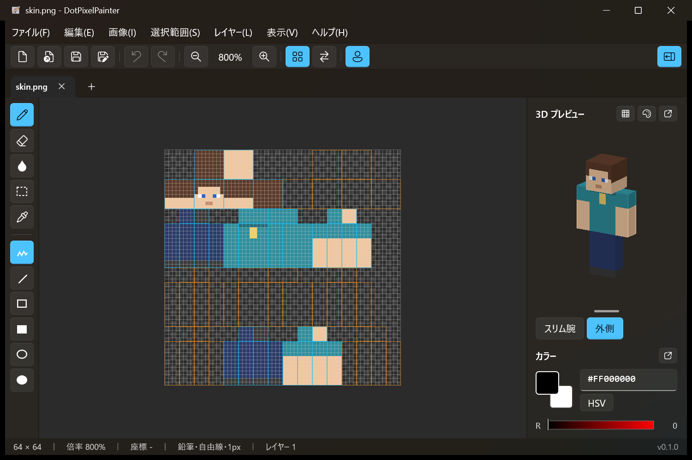

# DotPixelPainter

Windows 11 向けの、軽くてすぐ起動するドット絵（ピクセルアート）エディタです。Minecraft のスキンも描けます。
起動は 0.5 秒ほどで、インストールは要りません。



## できること

**描く**
- 鉛筆・消しゴム・塗りつぶし・スポイト、直線・四角・円（塗りあり・なし）
- ブラシの太さと形（四角・丸）
- ディザ（網かけ）のパターン塗り。75%・市松・25% など。すき間を背景色で塗る2色の網かけもできます
- 1px の線の角にできる余分な1ドットを、描きながら消す（ピクセルパーフェクト）
- カラーマスク：指定した色を守って塗る／指定した色の上だけに塗る

**見る**
- 1px のグリッド線、ドットがにじまない整数倍のズーム
- 等倍・2倍のプレビュー、3×3 に並べるタイル表示
- 表示だけの左右反転、透明部分の表示色（市松模様・白・黒など）の切り替え

**色**
- RGB・HSV のスライダー、カスタムパレット（GIMP の .gpl を読み書き）
- 色の段階（影からハイライトまでの色を自動で並べる）
- 色の置き換え、減色、絵で使っている色をパレットに取り込む

**編集**
- レイヤー（追加・複製・並べ替え・結合・不透明度）
- 範囲選択、移動、コピー・貼り付け（ほかのアプリとも）、反転・回転
- 画像の拡大縮小、キャンバスの大きさ変更、切り抜き、全体の反転・回転
- 線の整形（すでに描いた線の角を整える）
- 元に戻す・やり直し（Ctrl+Z / Ctrl+Y）

**ファイル**
- 独自形式 `.dotpix`（レイヤーを残す）と PNG。PSD も読み込めます
- タブで複数のファイルを開く、ドラッグ＆ドロップで開く、前回のタブを開き直す
- ドットのまま 2〜16 倍に拡大して PNG で書き出し
- パネルは別ウィンドウに切り離せます。窓が狭いときは右のパネルを自動でたたみます

**Minecraft スキン**

64×64 と 64×32 の画像は、スキンとして編集できます。展開図に部位のガイドが出て、右に 3D のプレビューが出ます（ドラッグで回せます）。腕の太さ（クラシック・スリム）と外側のレイヤーの表示も切り替えられます。



## ダウンロード

[Releases](https://github.com/Yocchan1513/DotPixelPainter/releases) から zip をダウンロードし、展開して `DotPixelPainter.exe` を起動します。インストールは不要です。

| ファイル | 向いているPC |
| --- | --- |
| `DotPixelPainter-<版>-win-x64.zip` | ふつうのPC（Intel・AMD）。迷ったらこれ |
| `DotPixelPainter-<版>-win-arm64.zip` | Snapdragon などの ARM の PC（Surface Pro 11 など） |
| `…-lite.zip` | 軽量版。Windows App Runtime 2.5 以上が入っている PC 向け |

署名のないアプリなので、初めて起動するときに「Windows によって PC が保護されました」と出ることがあります。「詳細情報」→「実行」で起動できます。

## 動作環境

- Windows 11（x64 / ARM64）
- 軽量版だけ、[Windows App Runtime](https://learn.microsoft.com/windows/apps/windows-app-sdk/downloads) 2.5 以上が必要です

## ビルド

.NET 10 SDK と、Visual Studio の「WinUI アプリケーション開発」ワークロードが必要です。

```powershell
dotnet build src/DotPixelPainter.App
```

配布用の zip は `./tools/package.ps1` で作ります（Native AOT のため、Visual Studio の「C++ によるデスクトップ開発」と、ARM64 版には ARM64 用のビルドツールも必要です）。

詳しくは [CLAUDE.md](CLAUDE.md) を参照してください。

## ライセンス

[MIT License](LICENSE) です。使用しているライブラリのライセンスは [THIRD-PARTY-NOTICES.md](THIRD-PARTY-NOTICES.md) にあります。
